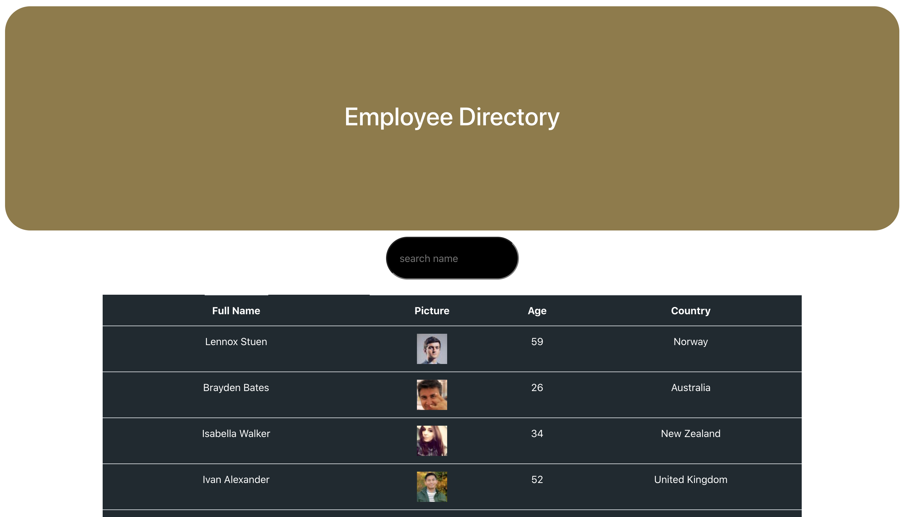

# Unit 19 React Homework: Employee Directory

# Genral Info
> The goal of this application was to use React for the first time from what we had learned in class. This is app consists of a directory of employees that display the employees name, age, picture, and country. An employer can access a specific employee by typing in their name or the first letters of their name. Also, can search in alphabetical order. The app takes some random employees from the API Random User Generator and then stores the random employees into the table format.

## Table of contents
* [General info](#general-info)
* [Link](#Link)
* [Screenshot](#screenrecording)
* [Technologies](#Technologies)
* [Status](#status)

## Link
Deployed App:https://dir-of-employees.herokuapp.com

## Screenshot

## Technologies
1. Node js
2. Axios
3. React
4. Heroku
5. HTML
6. CSS

## Status
Project is: _in progress_ because I am still learning.

